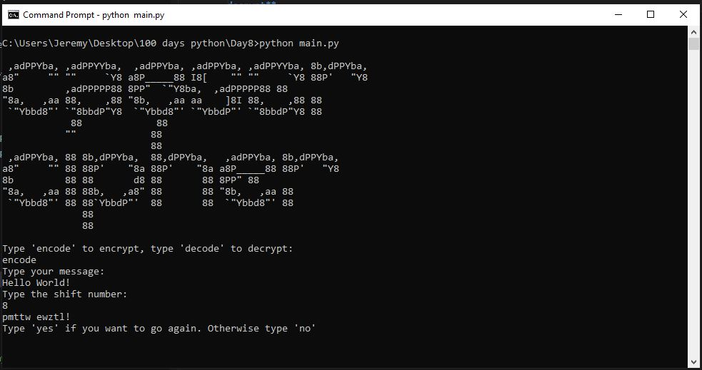
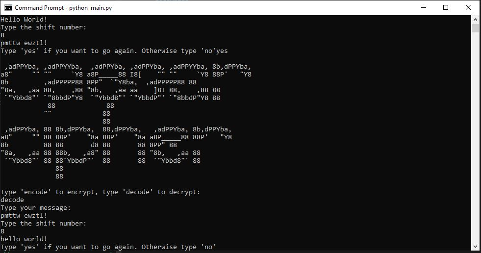

# Functions Parameters

**End of day project was a terminal cipher program that encrypt and decrypt. The user decides how many characters they want to shift the message by to encrypt and decrypt.**

